# TAREA 2- Publicación de mapas bajo estándares OGC utilizando base de datos espacial y servidor de mapas

 TAREA_2_3101490

# Objetivos

Entender el proceso de publicación de mapas en internet utilizando una base de datos espacial y un servidor de mapas bajo el marco de los estándares de interoperabilidad de OGC.

# Actividades

# 1. Definición del problema 

# • Describa un problema hipotético que pueda resolverse a través del análisis y visualización de datos espaciales.

La complejidad territorial implica una gama de opciones para interpretar los territorios pero, así mismo, requiere un esfuerzo para dar a entender la necesidad de diseñar modelos de futuro para un desarrollo sostenible. En este aspecto, los ejercicios que se encuentran sobre el diagnóstico territorial son mayores a los existentes sobre prospectiva territorial o modelación territorial. 
Tal como lo afirma Posada (2017) al referirse a la complejidad sobre los problemas territoriales que son tantos y tan variados que, a veces, las herramientas para tratarlos y manejarlos se quedan cortas. Aun así, en la evolución de las técnicas para el diseño territorial los SIG juegan un papel muy importante al permitir crear modelos en medio de la complejidad multiespacial, multitemporal y multiobjetivo. 
En consecuencia, el ordenamiento territorial como proceso de apropiación de la comunidad frente a su  territorio, en lo referente a escenarios deseados a futuro, desencadena la posibilidad de orientar y priorizar asuntos que relacionen las dinámicas locales, regionales y nacionales. Asimismo de los aspectos de carácter social, económico, ambiental y cultural que aseguren una gestión integral del territorio. 
# • Describa de forma general el enfoque propuesto para desarrollar el problema. 

# 2. Fuentes de datos

• Listado detallado de las fuentes de datos seleccionadas. Mínimo 3 conjuntos de datos vectoriales. Incluir información del proveedor de los datos, enlace para descarga, título y descripción del conjunto de datos, descripción de los atributos principales a utilizar. 

# • Páramos delimitados. Escala 1:25.000 

**Información del proveedor:** El Sistema de Información Ambiental de Colombia (SIAC) “Es el conjunto integrado de actores, políticas, procesos, y tecnologías involucrados en la gestión de información ambiental del país, para facilitar la generación de conocimiento, la toma de decisiones, la educación y la participación social para el desarrollo sostenible”.

**Enlace para descarga:** http://www.siac.gov.co/catalogo-de-mapas

**Título y descripción:**  Ubicación y seguimiento a la delimitación de páramos en Colombia. 

**Descripción atributos:** Páramo, Departamento, Área 

**•Ecosistemas generales de Colombia ** 

**Información del proveedor:** El Sistema de Información Ambiental de Colombia (SIAC) “Es el conjunto integrado de actores, políticas, procesos, y tecnologías involucrados en la gestión de información ambiental del país, para facilitar la generación de conocimiento, la toma de decisiones, la educación y la participación social para el desarrollo sostenible”.

**Enlace para descarga:** http://www.siac.gov.co/catalogo-de-mapas

**Título y descripción:**  De acuerdo con el mapa de ecosistemas continentales, costeros y marinos de Colombia, escala 1:100.000 (IDEAM, et al, 2015), Colombia cuenta con 98 tipos de ecosistemas generales, 74 corresponden a ecosistemas naturales y 24 a ecosistemas transformados y más de 8000 ecosistemas específicos.

**Descripción atributos:** 

**• Cobertura de la tierra 2010-2012 *** 

**Información del proveedor:** El Instituto de Hidrología, Meteorología y Estudios Ambientales -IDEAM- como integrante del Sistema Nacional Ambiental -SINA-, es responsable de la generación de información y conocimiento sobre el estado de los recursos naturales renovables del país, y como instituto de investigación de carácter nacional, juega un papel fundamental en el diseño de políticas para la protección y mejoramiento del medio ambiente.

**Enlace para descarga:** http://www.siac.gov.co/catalogo-de-mapas

**Título y descripción:**  La "Cobertura" de la tierra, es la cobertura (bio) física que se observa sobre la superficie de la tierra (Di Gregorio, 2005), en un término amplio no solamente describe la vegetación y los elementos antrópicos existentes sobre la tierra, sino que también describen otras superficies terrestres como afloramientos rocosos y cuerpos de agua. En términos puntuales para la delimitación de las coberturas de la Tierra, el IDEAM (1997) describe la cobertura como la unidad delimitable que surge a partir de un análisis de respuestas espectrales determinadas por sus características fisionómicas y ambientales, diferenciables con respecto a la unidad próxima.

**Descripción atributos:** 

**• Cartografía Base escala 1:25.000** 

**Información del proveedor:** La cartografía representa áreas del terreno que muestran elementos básicos como son curvas de nivel, aguas, red hídrica, y algunos elementos artificiales, humanos o culturales, como son las redes de transporte y los centros poblados, entre otros. La cartografía básica está orientada a la representación general de los elementos geográficos existentes en su ámbito, sin dar mayor intensidad a un fenómeno u otro (IGAC, Grupo IDE & GIG).

**Enlace para descarga:** https://geoportal.igac.gov.co/contenido/datos-abiertos-cartografia-y-geografia

**Título y descripción:**  Información espacial a escala 1:25.000 que se  integrara  en  una  geodatabasedel  Instituto  Geográfico  Agustín Codazzi (Igac, 2005), constituida por los Feature Datasets:  edificación  de  obra  civil,  transporte  terrestre,  transporte aéreo, instalación de construcciones  para  transporte,  cobertura  vegetal,  superficies  de agua, relieve, entidades territoriales y unidades administrativas  y  topónimos.

**Descripción atributos:** 

# 3. Procesamiento de datos 

• Descripción detallada del procesamiento realizado a los datos (algoritmos, herramientas utilizadas, modelos, etc)

En esta etapa se realizan procesos y tratamiento de los datos cartográficos principalmente para el área de estudio, lo primero que se debe realizar es definir el área de estudio y construir con los datos cartográficos la representación de la misma, la cual se conforma por el municipio de Ráquira en el Departamento de Boyacá, por  medio  de  la  herramienta  Select(ArcToolbox  >  Analysis  Tools  >  Extract), se extrajo el municipio central de estudio. 

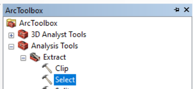

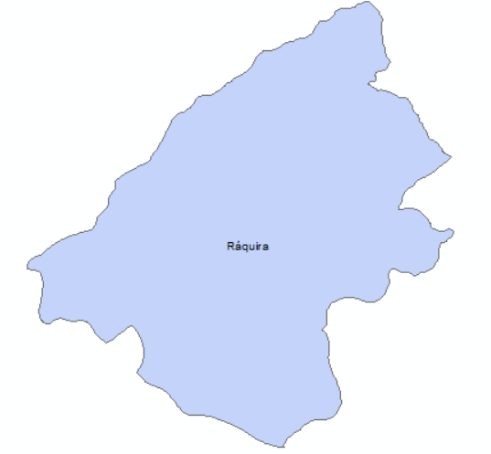

Realizando  un  buffer o zona de influencia (ArcToolbox > Analysis Tools > Proximity) con un radio de 20 Kilómetros.

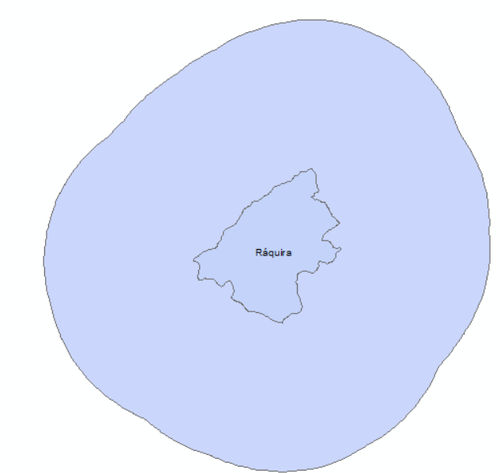

De modo que los municipios intersectados (ArcToolbox > Analysis Tools > Overlay) dentro de dicho polígono tuvieron que ser indagados frente al desarrollo actual de las potencialidades para establecer los integrantes del modelo y la necesidad de desarrollar las potencialidades comunes desde Ráquira como estrategia integradora supramunicipal con los lineamientos de una metodología prospectiva territorial de carácter no prescriptivo y un enfoque participativo, sujeta a entornos inestables,  complejos  y  dinámicos.

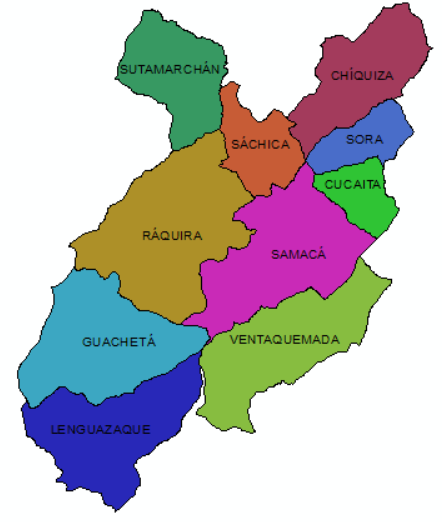

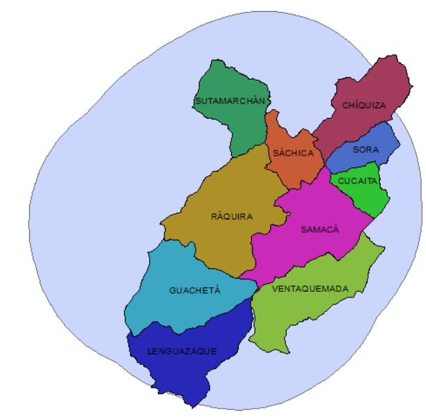

Fueron superpuestas capas relevantes como páramos, cobertura de tierras, superficies de agua y vías. Para el primer lapso de tiempo  se hizo un análisis espacial con la herramienta Clip (ArcToolbox > Analysis Tools > Extract) de Ráquira con capas como vías, páramos, cobertura vegetal, cobertura de tierra para identificar las fortalezas y las falencias de las potencialidades referidas a la producción minera (carbón) y al sector agrícola de forma espacial. Esta tarea se repite para cada uno de los municipios obtenidos de la tarea anterior.

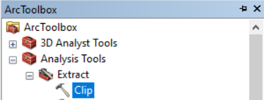

 
• Cargar los datos en el servidor postgresql/ postgis asignado para la clase. 

Por medio de Qgis se van a cargar cada una de las capas a la base de datos Postgis, para esto se debe crear una nueva conexión tal como se ilustra a continuación: 

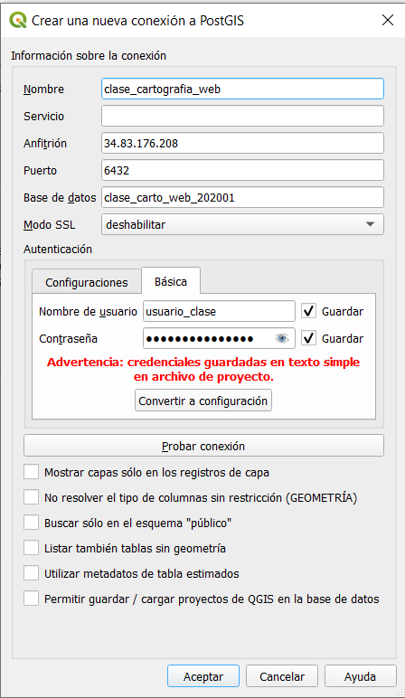

En la pestaña Bases de datos se hace clic en Administrador de Bases de Datos 

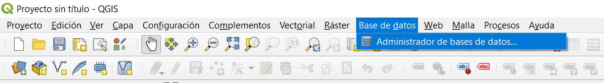

Se despliega la siguiente ventana, en donde se dará clic en Importar Capa/Archivo

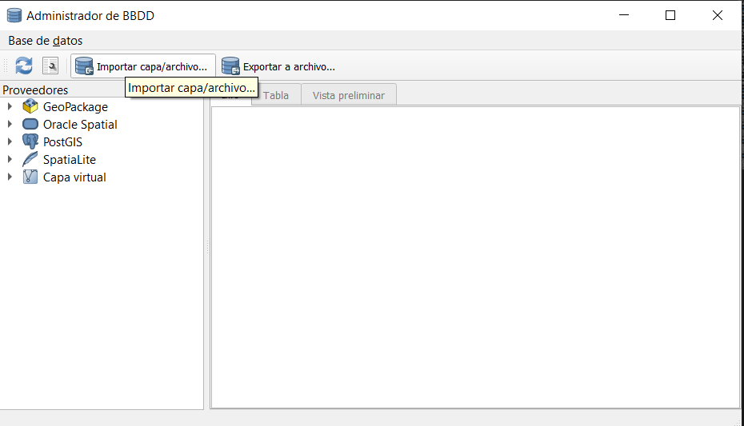

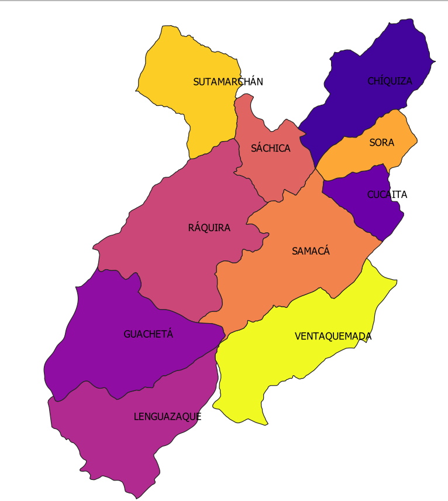

• Listar las capas cargadas en el servidor postgresql/postgis (Nota:No olvide el prefijo asignado para la clase.)

Se selecciona la capa que se desea cargar y se nombra con el prefijo asignado para la clase xc_ 

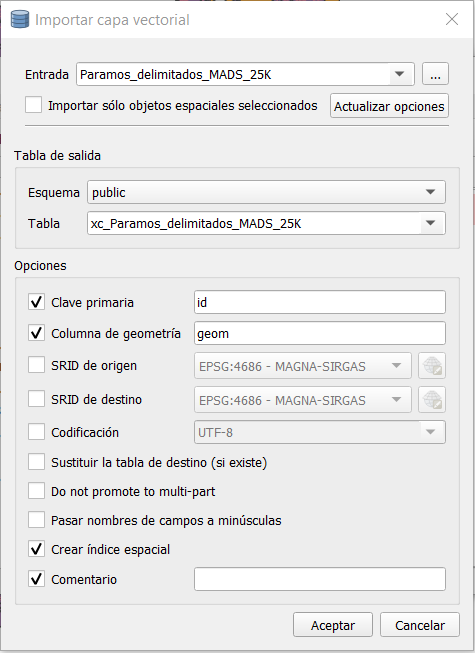

Realizar la publicación de las capas en Geoserver 

Vamos a la opción capas seguidamente agregar nuevo recurso 

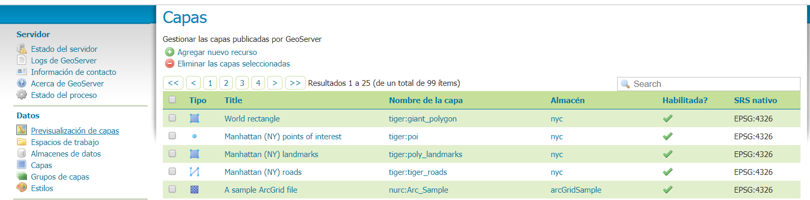

# 4. Capa Simbología SLD 

• Publicar una de las capas utilizando simbología en SLD
• Si utiliza QGIS para generar el SLD, favor mencionar brevemente el proceso realizado. 
Incluir texto del SLD en el markdown del Readme.md 
• Describir método utilizado para clasificar datos. 
Describir el criterio para la selección de los colores a utilizar en la simbología
• Las reglas de la simbología deben incluir control de escala y etiquetado.
Adjuntar imagen con la leyenda de la capa. 

# 5. Capa simbología CSS

• Publicar una de las capas utilizando simbología basada en CSS
• Incluir texto del CSS en el markdown del Readme.md
• Describir método utilizado para clasificar los datos.
• Describir el criterio para la selección de los colores a utilizar en la simbología
• Las reglas de la simbología deben incluir control de escala y etiquetado.
• Adjuntar imagen con la leyenda de la capa. 

# 6. Capa Simbología YSLD 

• Publicar una de las capas utilizando simbología basada en YSLD
• Incluir texto del YSLD en el markdown del Readmen.md 
• Describir método utilizado para clasificar los datos. 
• Describir el criterio para la selección de los colores a utilizar en la simbología 
* Las regals de la simbología deben incluir control de escala y etiquetado. 
Adjuntar imagen con la leyenda de la cpa 

# 7. Grupo de capas 

• Crear un layer group (https://docs.geoserver.org/stable/en/user/data/webadmin/layergroups.html ) que comtenga las capas creadas en los puntos, y   y las adicionales que considere necesarias para darle contexto a la visualización ( ejm. límites departamentales, límites municipales, límites internacionales, etc)
• Adjuntar  el URL  de la previsualización openlayers del conjunto de capas generada por Geoserver.Ejemplo: http://34.83.176.208:18080/geoserver/wms?service=WMS&version=1.1.0&request=GetMap&layers=tiger-ny&bbox=-74.047185%2C40.679648%2C-73.907005%2C40.882078&width=531&height=768&srs=EPSG%3A4326&format=application/openlayers

# 8. Conclusiones 

• Publicar un video en Loom ( https://www.loom.com/ ) de mínimo 5 minutos y máximo 8 y adjuntar el url del mismo. 
• En el video describa brevemente lo siguiente: 
* Problema planteado 
* Procesamiento y análisis realizado a los datos 
* Proceso de publicación de capas 
* Conclusiones del ejercicio desde el punto de vista temático según problema definido. 
Tutorial de loom https://support.loom.com/hc/en-us/articles/360006847737-Guide-to-Using-Loom-for-Education 

